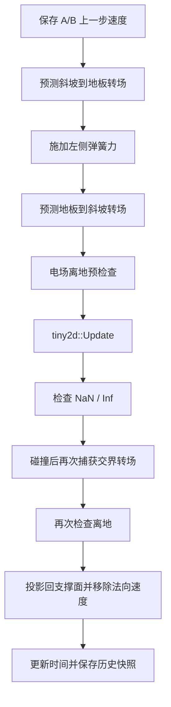

# Tiny2D Engine

> 当前开发版本：V14（未发布） / 最新正式版本：2.0（V10）<br>
> 开发语言：C++17<br>
> 图形与窗口：SDL2<br>
> 参数界面：Dear ImGui<br>
> 构建系统：CMake + vcpkg

Tiny2D Engine 是一个面向二维刚体和高中、大学普通物理题目的小型物理模拟
项目。当前开发线提供四个独立入口：V9 斜面实验、V11 RollLab、V13
Gravito-Orbit 和 V14 Driven PivotLab。V13 中还保留了无重力的 V12 E/B
预设；关闭 V14 的周期驱动则保持 V10 物理摆行为。所有实验都提供图形化参数
设置、实时监测和历史时刻查询。

这里同时使用两套编号：`2.0.0` 是已经发布的产品版本，对应 V10；`V9` 到
`V14` 是物理实验的迭代编号。下一次正式发布号确定前，CMake 和 vcpkg 继续
保持 `2.0.0`，不能把 V14 直接当作语义版本 `14.0.0`。

这份 README 主要写给未来的自己，用来回答以下问题：

- 项目中每个文件负责什么；
- 引擎每一步到底执行了什么；
- 碰撞、摩擦、弹簧和电场是怎样实现的；
- 界面中的真实数据怎样换算成内部像素数据；
- 修改或增加物理功能时应该从哪里开始；
- 当前实现已经支持什么，又明确不支持什么。

---

## 1. 项目定位

项目分成两层：

1. **Engine：通用二维矩形刚体内核**
   - 负责矩形刚体、积分、旋转、碰撞、摩擦、恢复系数、窗口边界、
     重力和均匀电场。
   - 不知道什么是“高考题”“斜坡底端”“左侧弹簧”或“监测窗口”。

2. **Sandbox：物理实验场景**
   - 负责模型选择、V9/V11/V13/V14 实验、参数菜单、SI 单位、暂停、
     历史数据和绘制。
   - 它是 Engine 的使用者，也是当前可执行程序。

区分这两层非常重要。能被其他二维物理场景复用的能力放进 `Engine/`；
只服务于当前题型的规则放进 `Sandbox/`。

---

## 2. 当前已经实现的功能

### 2.1 刚体内核

- 任意宽高的二维矩形刚体；
- 质心位置、线速度、角度和角速度；
- 动态刚体与质量为零的静态刚体；
- 可锁定转动的刚体；
- 半隐式欧拉积分；
- 重力场；
- 均匀电场和正、负、零电荷；
- 旋转矩形之间的 SAT 碰撞检测；
- 单接触点和双接触点流形；
- 基于冲量的碰撞响应；
- 恢复系数、库仑摩擦、角冲量和穿透修正；
- 窗口四边碰撞；
- 角速度指数阻尼；
- 非法输入和浮点溢出预检查。

### 2.2 V9 斜面实验

- 1200 × 800 像素实验窗口；
- 两个动态物块 A、B；
- 可开关的斜坡；
- 斜坡角度和真实长度设置；
- 物块在斜坡与底板之间双向过渡；
- 交界处速度大小守恒和防抖；
- 物块贴合支撑面的理想导轨约束；
- 可开关的左侧弹簧；
- 可开关的均匀电场；
- 电场导致物块无法贴面时自动停止；
- 使用 A 物块建立长度、时间、速度和质量标尺；
- SI 单位与像素单位自动换算；
- 开始前图形化参数设置；
- 滑块和精确键盘输入同时可用；
- 参数越界后自动夹紧；
- 实时显示质量、距离、位置、速度和加速度；
- Space 暂停/继续；
- 按真实时间查看历史快照；
- 物块中心标注 A、B；
- 斜坡底端标注倾角 `i`。

当前菜单只开放两个 **1 × 1 单位正方形物块**。Engine 底层已经使用
`Rectangle` 保存独立的宽和高，也保留了长板所需的长度字段，但长板还没有
在正式界面中启用。

### 2.3 V10 PivotLab 物理摆实验

- 一根绕端点转动的均匀刚性细杆；
- 一个位置可调的点状配重；
- 可设置杆长、杆质量、配重质量和配重到支点的距离；
- 可设置初始角度和初始角速度；
- 重力场取 9.8 或 10 m/s²；
- 配重可带正电、负电或不带电；
- 可设置均匀电场强度和任意平面方向；
- 可选线性转动阻尼；
- 实时显示转动惯量、角度、角速度、角加速度和各项力矩；
- 实时显示动能、重力势能、电势能和总机械能；
- 显示小角度近似周期；
- Space 暂停/继续，并可查询任意已记录时刻；
- 画面标注配重质量、电荷、摆角、电场和重力场方向；
- 所有实验由同一个启动界面选择，配置、状态和物理规则互不覆盖。

### 2.4 V11 RollLab 滚动实验

- 支持均匀实心圆盘和圆环；
- 使用 SI 单位模拟斜面上的滑动、动摩擦和静摩擦；
- 检测 `v - R*omega`，并在条件满足时切换为纯滚动；
- 可加入任意方向均匀电场和垂直屏幕的有符号磁场；
- 监测法向力、摩擦力、平动/转动能量和耗散能量；
- 磁场或电场使法向力失效时，以离开斜面的终止状态停止。

### 2.5 V12 OrbitLab 与 V13 Gravito-Orbit

- V12 使用均匀电场和均匀磁场中带电粒子的解析定步长解；
- 显示回旋角频率、周期、拉莫尔半径和复合场漂移；
- V13 在同一模型上加入沿 `-Y` 的均匀重力、重力势能和合外力漂移；
- 粒子离开 `20 m × 12 m` 实验区域后进入终止状态；
- V13 设置页可以一键加载 V12 无重力 E/B 预设。

### 2.6 V14 Driven PivotLab

- 在 V10 单自由度物理摆上加入 `A*cos(omega_d*t)` 周期驱动力矩；
- 提供共振预设，并显示驱动频率与固有频率之比；
- 实时显示驱动力矩和瞬时驱动功率；
- 关闭驱动或把振幅设为零时，精确保留 V10 的无驱动轨迹。

---

## 3. 项目目录

```text
Tiny2DEngine/
├── .vscode/
│   ├── settings.json              # VS Code、CMake、C++17 和格式化设置
│   ├── tasks.json                 # Ctrl+Shift+B 配置与编译任务
│   └── launch.json                # F5 调试配置
├── Engine/
│   ├── tiny2d_engine.h            # 对外数据结构和公开 API
│   ├── tiny2d_engine.cc           # 刚体、碰撞、积分和输入保护
│   └── tiny2d_engine_test.cc      # Engine 单元测试和性质测试
├── Sandbox/
│   ├── main.cc                    # 程序初始化和四个模型入口
│   ├── simulations.h             # 四个实验的最小公共入口
│   ├── fixed_step_clock.h         # SDL 计数器到固定物理步的共享适配
│   ├── sim_ui.h                   # 共享滑块、精确输入框和箭头绘制
│   ├── simulation_history.h       # 有界历史保存与抽稀
│   ├── incline_spring_model.*     # V9 场景模型
│   ├── incline_spring_simulation.cc
│   ├── rotation_pendulum_model.*  # V10/V14 物理摆模型
│   ├── rotation_pendulum_simulation.cc
│   ├── rolling_disk_model.*       # V11 滑动/滚动模型
│   ├── rolling_disk_simulation.cc
│   ├── lorentz_particle_model.*   # V12/V13 带电粒子模型
│   ├── lorentz_particle_simulation.cc
│   └── *_test.cc                  # 四个场景模型的测试
├── build/                         # CMake 生成目录，不提交 Git
├── .clang-format                  # Google C++ 格式规则
├── .gitignore                     # 忽略构建产物和编辑器临时文件
├── CMakeLists.txt                 # 库、程序和测试目标
├── CMakePresets.json              # Debug/Release 配置与测试预设
├── vcpkg.json                     # SDL2 和 ImGui 依赖清单
└── README.md                      # 本文档
```

八个 CMake 目标的关系：

| 目标 | 类型 | 作用 |
|---|---|---|
| `Tiny2DEngine` | 静态库 | 通用矩形刚体物理内核 |
| `Tiny2DSimulationModels` | 静态库 | 四个 Sandbox 模型的可测试生产代码 |
| `Sandbox` | Windows 可执行程序 | 四个模型的选择和可视化实验 |
| `Tiny2DEngineTests` | 测试程序 | Engine 层测试 |
| `Tiny2DSimulationTests` | 测试程序 | V9 场景层测试 |
| `Tiny2DRotationPendulumTests` | 测试程序 | V10/V14 物理摆测试 |
| `Tiny2DRollingDiskTests` | 测试程序 | V11 滚动模型测试 |
| `Tiny2DLorentzParticleTests` | 测试程序 | V12/V13 带电粒子测试 |

---

## 4. 构建、运行和调试

### 4.1 当前开发环境

当前预设按本机环境配置：

- Visual Studio 2022（17.x）；
- MSVC x64；
- CMake；
- Ninja Multi-Config；
- Visual Studio 自带 vcpkg；
- C++17。

`vcpkg.json` 会安装：

- SDL2；
- Dear ImGui；
- ImGui 的 SDL2 和 SDL_Renderer2 后端。

如果以后更换 Visual Studio 版本或安装位置，需要同步检查：

- `CMakePresets.json` 中的 `CMAKE_TOOLCHAIN_FILE`；
- `.vscode/settings.json`；
- `.vscode/tasks.json`。

### 4.2 第一次配置

从开始菜单打开 **Developer PowerShell for VS 2022**，再进入项目根目录。
这个终端会提供当前预设需要的 MSVC、CMake、Ninja 和 Visual Studio 内置
vcpkg 环境；不要用尚未加载 VS 开发环境的普通 PowerShell：

```powershell
cmake --preset msvc-x64
```

该命令会创建 `build/`，读取 `vcpkg.json`，寻找或安装 SDL2 与 ImGui，
然后生成 Debug/Release 共用的多配置构建目录。

### 4.3 Debug 构建和运行

```powershell
cmake --build --preset debug
./build/Debug/Sandbox.exe
```

Debug 版本保留断言，适合日常开发和定位问题。

### 4.4 Release 构建和运行

```powershell
cmake --build --preset release
./build/Release/Sandbox.exe
```

Release 版本关闭普通 Debug 断言，但项目测试使用独立的 `CHECK`，所以 Release
测试并不会变成空测试。

### 4.5 VS Code

- `Ctrl+Shift+B`：执行 `CMake: Build`，先配置再构建 Debug；
- `F5`：启动 CMake 当前选中的可执行目标；
- 调试前应确认 CMake Tools 当前启动目标为 `Sandbox`。

如果 F5 试图运行 `Tiny2DEngine.lib`，说明选中了静态库而不是程序。将启动目标
改为 `Sandbox.exe` 即可。

---

## 5. 如何使用当前程序

程序启动后先进入模型选择页：

- `Open V9 incline laboratory`：进入已验证的斜面、底板、弹簧与电场实验；
- `Open V14 Driven PivotLab`：进入 V10 兼容的受迫阻尼物理摆；
- `Open V11 RollLab`：进入圆盘/圆环滑动到纯滚动实验；
- `Open V13 Gravito-Orbit`：进入 V12/V13 均匀复合场带电粒子实验；
- 每个实验的返回按钮都会回到模型选择页，不会覆盖其他实验。

### 5.1 V9 推荐操作顺序

1. 先输入题目给出的底板长度、斜坡长度、斜坡角度、A 的参考速度、A 的
   参考质量和重力加速度。
2. 设置摩擦系数和恢复系数。
3. 按需启用弹簧或电场；如果启用电场，再设置电场强度、方向和物块电荷。
4. 通常不要修改 `Advanced engine values`。只有需要改变初始像素位置或内部
   速度时才展开这一栏。
5. 确认底部显示 `Ready to start.`，然后点击 `Start simulation`。
6. 运行中按 Space 暂停或继续。
7. 取消 `Live` 或修改 `Inspect time`，查看某个历史时刻的数据。

所有连续数值左侧是滑块，右侧是精确输入框。输入超出范围的数值后，程序会
自动把它夹到最小值或最大值。

### 5.2 V10/V14 推荐操作顺序

1. 设置杆长 `L`、杆质量 `M`、配重质量 `m` 和配重距离 `r`。
2. 设置相对竖直向下方向的初始角度和初始角速度。
3. 选择重力加速度。
4. 按需启用电场、配重电荷、转动阻尼和周期驱动。
5. 确认底部显示 `Ready`，然后启动模拟。
6. 在监视窗口查看力矩、能量和小角度周期；Space 可暂停或继续。
7. 取消 `Live` 或输入 `Inspect time`，查看某个历史时刻。
8. 使用 `Load V10 baseline` 恢复无驱动 V10，或使用
   `Load V14 resonance preset` 观察受迫共振。

V10 默认参数为：`L = 2 m`、`M = 2 kg`、`m = 1 kg`、`r = 1.5 m`、
初始角 `35°`、初始角速度 `0 rad/s`、`g = 9.8 m/s²`。默认启用
`E = 5 N/C`、方向为相对 `+X` 轴逆时针 `0°` 的均匀电场，配重带
`q = 1 C`；转动阻尼默认关闭。

### 5.3 V9 默认场景

| 参数 | 默认值 |
|---|---:|
| 窗口 | 1200 × 800 px |
| 物理固定步长 | 1/120 模拟秒 |
| 单位物块边长 | 32 px |
| 底板真实长度 | 3.0 m |
| 斜坡真实长度 | 3.4641016 m |
| 斜坡角 | 30° |
| 重力加速度 | 9.8 m/s² |
| 摩擦系数 | 0 |
| 恢复系数 | 1 |
| 弹簧 | 开启，内部强度 8 |
| 电场 | 关闭 |
| A | 斜坡上，1 kg，初速度 1 m/s，对应 200 px/s |
| B | 底板与斜坡交界左侧，3 kg，初速度 0 |

默认几何会得到：

```text
长度标尺          = 200 px/m
速度标尺          = 200 px/s 对应 1 m/s
真实时间/模拟时间 = 1
质量标尺          = 1 引擎质量单位/kg
像素重力          = 1960 px/s² 对应 9.8 m/s²
斜坡底端 x        = 600 px
```

B 的中心默认在 `x = 584 px`，宽度为 32 px，因此它的右边缘正好位于
斜坡底端 `x = 600 px`。

### 5.4 V9 菜单允许的范围

| 参数 | 范围 |
|---|---:|
| 底板长度 | 0.1～10000 m |
| 斜坡长度 | 0.1～10000 m |
| 斜坡角 | 5～45° |
| A 参考速度 | 0.01～1000 m/s |
| A 参考质量 | 0.01～10000 kg |
| 重力 | 9.8 或 10 m/s² |
| 摩擦系数 | 0～5 |
| 恢复系数 | 0～1 |
| 电场强度 | 0～1000000 N/C |
| 电场角度 | -180～180° |
| A/B 电荷 | -1000～1000 C |
| 弹簧内部强度 | 0.1～100 |
| A/B 引擎质量 | 0.01～1000 |
| A/B 像素初速度 | -5000～5000 px/s |

单项位于范围内不代表组合一定稳定。程序还会检查派生标尺、一步位移、电场
加速度、弹簧刚度、初始重叠和支撑面长度；危险组合仍会禁止启动。

### 5.5 V10/V14 菜单允许的范围

| 参数 | 范围 |
|---|---:|
| 杆长 | 0.1～20 m |
| 杆和配重质量 | 0.01～1000 kg |
| 配重距离 | 0～杆长 |
| 初始角度 | -180～180° |
| 初始角速度 | -50～50 rad/s |
| 重力 | 9.8 或 10 m/s² |
| 配重电荷 | -1000～1000 C |
| 电场强度 | 0～1000000 N/C |
| 电场角度 | -180～180° |
| 线性转动阻尼系数 | 0～1000 N·m·s/rad |
| 周期驱动力矩振幅 | 0～1000 N·m |
| 驱动角频率 | 0～60 rad/s |

V14 还会验证转动惯量、回复力矩、驱动相位步长、小角度周期和初始派生量是否
有限，并估算最大角速度和角加速度；固定步长无法稳定处理的参数组合会被拒绝。

---

## 6. 坐标、角度和正负号约定

### 6.1 屏幕坐标

SDL 使用屏幕坐标：

- 原点在窗口左上角；
- `+x` 向右；
- `+y` 向下。

因此监视面板中的位置 `(x, y)` 虽然换算成了米，但仍然使用屏幕方向，不能
直接把 `y` 当成“从地面向上的高度”。

### 6.2 角度

Engine 中角度使用弧度。由于屏幕 `+y` 向下，数学旋转矩阵在画面上的视觉
方向与通常的笛卡尔坐标需要结合屏幕方向理解。

Sandbox 菜单中的电场角度采用更直观的约定：

- 相对 `+x` 轴逆时针；
- `0°` 向右；
- `90°` 向上；
- `-90°` 向下；
- `180°` 向左。

V10 的摆角 `theta` 以竖直向下为零，逆时针为正；初始角度、监视窗口和
画面角弧都使用同一约定。

内部转换为：

```text
E_pixel.x = |E_pixel| cos(theta)
E_pixel.y = -|E_pixel| sin(theta)
```

### 6.3 速度和距离符号

监视面板使用题目方向约定，而不是简单显示 `vx`：

- 斜坡上向左下为正，向右上为负；
- 底板上向左为正，向右为负；
- 斜坡上距底端的距离为正；
- 底板上距交界的距离为负；
- 交界处距离为 0；
- 未启用斜坡时距离显示 `N/A`。

---

## 7. Engine 公开数据结构与 API

公开声明位于 `Engine/tiny2d_engine.h`，命名空间为 `tiny2d`。

### 7.1 `Vec2`

```cpp
struct Vec2 {
  float x{};
  float y{};
};
```

它只保存二维分量。向量加减、点积、叉积、长度和归一化目前是
`tiny2d_engine.cc` 内部实现，没有公开成完整数学库。

### 7.2 `Rectangle`

```cpp
struct Rectangle {
  float mass{1.0f};
  Vec2 position{};
  Vec2 velocity{};
  float angle{};
  float angular_velocity{};
  float width{40.0f};
  float height{40.0f};
  bool fixed_rotation{};
  float charge{};
};
```

| 字段 | 含义 |
|---|---|
| `mass` | 质量；0 表示静态刚体 |
| `position` | 矩形几何中心 |
| `velocity` | 质心线速度 |
| `angle` | 旋转角，单位弧度 |
| `angular_velocity` | 角速度 |
| `width`、`height` | 矩形宽高 |
| `fixed_rotation` | 是否锁定旋转 |
| `charge` | 电荷量；0 表示不受电场力 |

动态质量必须至少为 `1e-6`。静态刚体必须保持线速度和角速度为零；当前内核
没有单独的“运动学刚体”类型。

### 7.3 公开函数

| API | 作用 |
|---|---|
| `GetLinearAcceleration` | 计算重力与均匀电场产生的线加速度 |
| `GetVertices` | 根据中心、宽高和角度计算四个世界坐标顶点 |
| `IsColliding` | 使用 SAT 判断两个旋转矩形是否发生正面积重叠 |
| `Update` | 执行一次积分、刚体碰撞和窗口边界求解 |

`IsColliding` 把“刚好接触、重叠量为零”视为不碰撞。这样可避免仅仅贴边时
生成无意义的穿透流形。

---

## 8. Engine 物理实现

### 8.1 一次 `Update` 的顺序

`tiny2d::Update` 的真实执行顺序如下：

1. 验证时间步、区域尺寸、摩擦、恢复系数、电场、重力和所有刚体；
2. 预估本次积分，确认加速度、速度、位置和角度不会超出 `float` 范围；
3. 更新动态刚体线速度；
4. 对未锁定刚体施加角阻尼；
5. 使用更新后的速度更新位置；
6. 更新角度，并将其限制在一个 `2π` 周期内；
7. 执行 4 轮碰撞求解；
8. 每轮依次处理所有刚体对和窗口四边。

仅第一轮碰撞求解允许恢复系数产生反弹，后续三轮用于继续消除穿透和稳定
接触，避免同一物理步重复注入弹性能量。

### 8.2 线性积分

对于质量大于零的刚体：

```text
a = (0, gravity) + qE / m
v_new = v_old + a * dt
x_new = x_old + v_new * dt
```

先更新速度，再用新速度更新位置，这是半隐式欧拉法。它比完全显式欧拉法
更适合简单实时物理，但仍然属于离散数值积分。

### 8.3 角运动

未锁定转动时：

```text
omega_new = omega_old * exp(-0.7 * dt)
angle_new = remainder(angle_old + omega_new * dt, 2*pi)
```

`0.7` 是当前固定角阻尼系数。`fixed_rotation == true` 时，逆转动惯量为零，
角速度每步归零，碰撞只能改变线速度。

### 8.4 顶点计算

矩形先在局部坐标中生成四个角：

```text
(-w/2, -h/2), (w/2, -h/2), (w/2, h/2), (-w/2, h/2)
```

然后使用角度的旋转矩阵变换，并加上质心位置：

```text
world_vertex = position + R(angle) * local_vertex
```

碰撞和绘制都使用同一组旋转后顶点，因此画面形状与物理形状保持一致。

### 8.5 SAT 碰撞检测

矩形碰撞使用分离轴定理（Separating Axis Theorem）：

1. 从 A 的两个局部轴和 B 的两个局部轴得到 4 条候选轴；
2. 将两个矩形的四个顶点投影到每条轴上；
3. 任意轴不存在正重叠量，则两个矩形不碰撞；
4. 所有轴都重叠时，选择重叠量最小的轴作为碰撞法线；
5. 根据两个质心的相对位置修正法线方向，使法线从 A 指向 B。

当前物体数量很少，所以直接检查所有刚体对，复杂度是 `O(n²)`。

### 8.6 接触流形

确定碰撞法线后，引擎会：

1. 在参考矩形上寻找最朝向碰撞法线的面；
2. 在另一个矩形上寻找与它相对的入射面；
3. 将入射边裁剪到参考面的两个侧平面之间；
4. 保留位于参考面内侧的点；
5. 得到一个或两个接触点。

如果裁剪没有产生接触点，则使用两个矩形的支撑特征计算后备接触点。

双接触点会优先联合求解。这样对称的面对面碰撞不会因为“先算左点还是先算
右点”而产生虚假的角速度。如果联合求解得不到有效的非负冲量，再退回逐点
求解。

### 8.7 碰撞冲量

接触点速度同时包含质心速度与转动贡献：

```text
v_contact = v_center + omega × r
```

矩形转动惯量：

```text
I = m * (width² + height²) / 12
```

法向冲量负责阻止相互穿透并实现反弹；偏心接触产生的 `r × J` 会改变角
速度，因此未锁定矩形能够自然旋转。

恢复系数含义：

- `0`：完全非弹性；
- `1`：理想弹性；
- 中间值：保留部分法向相对速度。

当接触法向速度绝对值小于 `20` 个内部速度单位时，恢复系数被强制视为 0，
用于抑制静止接触附近的微小反复弹跳。

### 8.8 摩擦

法向冲量求解后，程序计算接触点的切向相对速度，并施加摩擦冲量：

```text
|J_t| <= friction * J_n
```

摩擦冲量既能改变线速度，也能通过接触点力臂改变角速度。

### 8.9 穿透修正

单纯修改速度不能立即消除已经存在的位置重叠，因此每轮求解还会进行位置
修正：

```text
slop = 0.01
correction_percent = 0.8
```

`0.01` 以内的微小穿透被容忍，其余穿透按逆质量比例修正 80%。这能减少
浮点误差导致的持续抖动。

### 8.10 窗口边界

窗口左、右、上、下四边使用与刚体碰撞相同的接触速度、恢复系数、摩擦和
角冲量逻辑。检测使用旋转后的顶点，最后会把越界刚体沿边界内法线移回合法
区域。

---

## 9. Sandbox 的真实单位换算

Engine 只处理内部数值，并不知道“米”“千克”或“秒”。Sandbox 使用 A 的
参考数据建立标尺，使用户只需要输入题目中的真实数据。

设：

```text
L_floor = 底板真实长度
L_ramp  = 斜坡真实长度
theta   = 斜坡角的正值
P       = 长度标尺，单位 px/m
S       = 速度标尺，单位 (px/模拟秒)/(m/真实秒)
T       = 真实秒/模拟秒
M       = 引擎质量单位/kg
A_s     = 加速度标尺，单位 (px/模拟秒²)/(m/真实秒²)
```

### 9.1 长度标尺

未启用斜坡：

```text
P = 1200 / L_floor
```

启用斜坡：

```text
P_horizontal = 1200 / (L_floor + L_ramp * cos(theta))
P_vertical   = (800 - 220 - 32) / (L_ramp * sin(theta))
P            = min(P_horizontal, P_vertical)
```

取较小值保证整个几何既不越过窗口右边，也不侵入顶部监视面板。

```text
斜坡底端 x   = L_floor * P
斜坡像素长度 = L_ramp * P
```

### 9.2 速度和时间标尺

```text
S = |A 的像素初速度| / A 的真实参考速度
T = S / P
真实时间 = 模拟时间 * T
```

这意味着改变题目的真实速度通常不会改变画面中 A 的默认像素速度，而是改变
“一个模拟秒代表多少真实秒”。

### 9.3 质量标尺

```text
M = A 的引擎质量 / A 的真实参考质量
显示质量 = 引擎质量 / M
```

默认 A 的引擎质量和真实质量都是 1，所以默认 `M = 1`。B 的引擎质量为 3，
因此默认显示 3 kg。

### 9.4 加速度和重力标尺

```text
A_s = S² / P
g_pixel = g_real * A_s
```

监视面板换算回 SI 时：

```text
a_real = a_pixel / A_s
```

### 9.5 电场标尺

电场输入单位为 N/C。为了让 `a = qE/m` 与重力使用完全相同的加速度标尺：

```text
E_engine = E_SI * M * A_s
```

Engine 计算：

```text
a_engine = q * E_engine / m_engine
```

换算回 SI 后仍然满足：

```text
a_real = q * E_SI / m_real
```

---

## 10. Sandbox 场景实现

### 10.1 场景对象

开始模拟时创建：

- 动态物块 A；
- 动态物块 B；
- 如果启用斜坡，再创建一个 `mass = 0` 的大型静态旋转矩形。

底板本身没有单独创建刚体，它直接使用 Engine 的窗口下边界。A、B 在当前
场景中都设置 `fixed_rotation = true`，姿态由斜坡/底板转场规则管理。

### 10.2 固定时间步主循环

渲染使用 VSync，但物理不直接使用渲染帧时间。四个实验共用
`FixedStepClock` 把 SDL 高精度计数器转换为累计秒数；V9 按固定的 `1/120`
模拟秒执行物理，其余实验使用 `1/240` 秒：



固定步长使物理结果基本不受显示器帧率影响。单个渲染帧最多计入 0.25 秒，
避免窗口被拖动或程序卡顿后一次补算过长时间。

### 10.3 斜坡与底板转场

物块在斜坡与底板交界时不能保持同一个角度，否则会以倾斜姿态进入水平地面。
当前场景使用专用转场规则：

1. 检查物块是否为动态、锁定旋转且朝交界运动；
2. 根据前沿角点或边缘预测本步是否跨过交界；
3. 计算本步内到达交界的时间；
4. 保留速度大小，只把速度方向旋转到新支撑面的切线；
5. 对位置做预补偿，使剩余子步仍能正确积分；
6. 在斜坡角与 0 之间切换姿态；
7. 将角速度归零。

理想转场不额外损失能量。`0.05 px` 的滞回范围用于防止物块在交界附近一帧
上坡、一帧下地板地反复切换。碰撞求解后还会用 `dt = 0` 再检查一次，捕获
由碰撞冲量直接推过交界的情况。

### 10.4 贴面约束

`ConstrainBodiesToSurfaces` 是当前场景专用的理想导轨约束：

- 把物块中心沿支撑面法线投影回正确高度；
- 移除法向速度，只保留沿斜坡或底板的速度；
- 物块越过斜坡顶端时夹紧位置；
- 去掉继续冲出斜坡顶端的速度分量。

它保证当前高考物理模型中的物块始终贴面，但它不是 Engine 的通用接触约束
求解器。

### 10.5 左侧弹簧

默认斜坡底端为 `x = 600 px`，弹簧休止端位于：

```text
spring_rest_x = 0.6 * ramp_bottom_x = 360 px
```

弹簧只作用于已经进入休止端左侧、位于底板上且最靠左的动态物块：

```text
compression = spring_rest_x - body_left_edge
delta_vx = spring_strength * compression / mass * dt
```

方向始终向右。当前 `spring_strength` 是内部引擎参数，不是严格换算后的 SI
弹簧劲度系数 N/m；因此监视和题目对齐时，弹簧部分仍属于视觉与行为模型。

### 10.6 电场与离地检测

均匀电场对带电动态物块产生：

```text
a_electric = qE / m
```

由于斜坡和底板是单侧支撑面，它们可以把物块向外推，却不能把物块拉回。
启用电场后，程序会计算重力和电场合加速度在当前支撑面外法线上的分量。

如果：

```text
dot(acceleration, outward_normal) > 0.0001
```

说明物块无法继续贴面，模拟会立即停止并报告是 A 还是 B 离开支撑面。检查
分别发生在 Engine 更新前和更新后，避免先产生非法状态再继续记录历史。

### 10.7 绘制

每个矩形使用四个 `SDL_Vertex`，索引为：

```text
0, 1, 2, 0, 2, 3
```

也就是用两个三角形填充矩形。顶点位置使用浮点坐标并通过
`SDL_RenderGeometry` 绘制，旋转运动不会因为过早转换为整数而明显跳动。

- 动态物块绘制为红色；
- 静态斜坡绘制为灰蓝色；
- 弹簧绘制为黄色折线；
- A/B 文本放在物块几何中心；
- 斜坡底端绘制角弧和 `i = xx.x deg`。
- 电场启用时显示绿色 `E` 方向箭头和真实 N/C 数值；
- 重力场始终显示黄色向下箭头和真实 m/s² 数值。

### 10.8 V10/V14 物理摆方程

V10 是一个单自由度物理摆：质量为 `M`、长度为 `L` 的均匀细杆绕端点
转动；质量为 `m`、电荷为 `q` 的点状配重位于距支点 `r` 处。转动惯量为：

```text
I = (1/3) M L² + m r²
```

设 `theta` 为相对竖直向下的逆时针角度，电场角度 `phi` 相对 `+X` 轴
逆时针。V14 额外加入周期驱动力矩：

```text
tau_g = -g (M L/2 + m r) sin(theta)
tau_E = q r E cos(theta - phi)
tau_d = -c omega                 # 仅在启用阻尼时
tau_drive = A cos(omega_d t)     # 仅在启用驱动且 A > 0 时
alpha = (tau_g + tau_E + tau_d + tau_drive) / I
P_drive = tau_drive * omega
```

状态使用 `1/240 s` 固定步长和半隐式欧拉法更新：先用当前角加速度更新
角速度，再用新角速度更新角度。角度通过 `remainder` 保持在一个周期内。
程序同时计算转动动能、重力势能、电势能和总能量。无阻尼且无驱动时可用总
能量检查数值稳定性；存在阻尼或外部驱动时，机械能不再守恒。

---

## 11. 监视面板和历史数据

V9 使用顶部监视面板；V11、V13 和 V14 使用独立的左侧监视窗口。

### 11.1 系统信息

面板实时显示：

- RUNNING / PAUSED；
- 真实物理时间；
- 摩擦系数；
- 恢复系数；
- 斜坡开关和角度；
- 弹簧开关和内部强度；
- 电场开关、强度和方向；
- A/B 电荷；
- `px/m`；
- 像素重力与真实重力的对应关系。

### 11.2 A/B 遥测

| 列 | 含义 |
|---|---|
| `Mass (kg)` | 按 A 的质量标尺换算后的真实质量 |
| `Distance (m)` | 相对斜坡底端的带符号距离 |
| `Position (m)` | 屏幕坐标换算成米后的 `(x, y)` |
| `Signed speed (m/s)` | 沿支撑面方向的带符号速率 |
| `Surface acceleration` | 沿支撑面方向的带符号加速度 |
| `Vector acceleration` | 二维加速度向量 |

初始快照的加速度来自重力和电场理论值。后续快照使用：

```text
acceleration = (current_velocity - previous_velocity) / dt
```

因此后续显示的是一个固定步内的有效平均加速度，能够包含弹簧和碰撞冲量造成
的速度变化。

### 11.3 暂停和历史查询

- Space：暂停或继续；
- `Live`：跟随当前时刻；
- `Inspect time`：用滑块或键盘输入真实秒；
- 修改查看时间后自动关闭 Live；
- 查询时选择时间上最接近的已保存固定步快照，不进行插值。

每个成功物理步都会生成快照，但每个模型最多保留 16384 条。达到上限后，
程序保留首条和最新记录，并对中间旧记录隔一抽稀；因此仍可查询从 `t = 0`
到当前的整个时间范围，但较早区间的时间分辨率会逐级降低。

### 11.4 V10/V14 转动监视

V14 监视窗口显示：

- 时间、`theta`、`omega`、`alpha`；
- 总转动惯量和小角度近似周期；
- 重力、电场、阻尼、周期驱动和合力矩；
- 驱动频率比、驱动力矩和瞬时驱动功率；
- 动能、重力势能、电势能和总能量；
- `Live`、精确历史时间输入、暂停和返回模型选择。

V11、V13 和 V14 都以 `1/240 s` 固定步长生成状态快照；V9 使用
`1/120 s`。历史查询选择最近保留的快照，不进行插值，也不改变正在运行的
当前状态。

---

## 12. 输入验证和安全停止

### 12.1 Engine 层

以下输入会在修改刚体状态前抛出 `std::invalid_argument`：

- `delta_time` 为负数、NaN 或无穷；
- 模拟区域宽高非正或非有限；
- 恢复系数不在 `[0, 1]`；
- 摩擦系数为负或非有限；
- 电场、重力或刚体字段包含非有限数值；
- 宽或高非正；
- 动态质量小于 `1e-6`；
- 静态刚体带有非零线速度或角速度；
- 动态矩形尺寸大到无法放入模拟区域；
- 惯量、加速度或本次积分结果可能超出稳定 `float` 范围。

### 12.2 Sandbox 层

开始按钮还会检查：

- 所有菜单范围；
- A 像素初速度不能接近 0，因为它定义时间标尺；
- A/B 初始位置必须位于各自支撑面范围内；
- A/B 不能初始重叠；
- 斜坡和底板必须能容纳物块；
- 所有派生标尺必须为正且有限；
- 重力和电场加速度不能超出 `float`；
- 初始速度和场力造成的一步位移不能超过 8 px；
- 弹簧、压缩范围和最小质量的组合不能过硬。

运行期间还会：

- 在 Engine 更新前后检查电场离地；
- 捕获 Engine 可预期的 `std::invalid_argument` 校验异常；
- 检查所有刚体是否出现 NaN/Inf；
- 发生错误后清空场景、返回设置界面并弹出原因。

V9 保留这条可恢复路径，用户可以修改参数后重新开始。应用最外层还保留
`std::exception` 兜底；无法安全恢复的异常会显示原因并让程序以非零代码退出。

### 12.3 V10/V14 物理摆层

V14 在开始前检查全部输入是否有限、质量和长度是否为正、配重是否位于杆上、
重力是否为 9.8 或 10，以及电荷、电场、角度、角速度和阻尼是否越界。随后
继续检查驱动力矩/频率、转动惯量、力矩、周期、能量和预计最大角速度/角加速
度，拒绝固定步长无法稳定计算的组合。运行中若状态或派生量出现 NaN/Inf，
模拟会停止并报告错误。

---

## 13. 测试体系

### 13.1 运行测试

```powershell
cmake --build --preset debug
ctest --preset test-debug

cmake --build --preset release
ctest --preset test-release
```

五个测试目标都设置了 30 秒超时。

### 13.2 为什么不使用普通 `assert`

标准 `assert` 在 Release 的 `NDEBUG` 下会被删除，测试程序可能什么都没检查
却返回成功。当前测试使用始终生效的最小 `CHECK`，所以 Debug 和 Release 都
会真正执行判定。

### 13.3 Engine 测试

`Engine/tiny2d_engine_test.cc` 主要覆盖：

- 旋转矩形顶点和边长；
- SAT 检测和交换 A/B 后的对称性；
- 对称碰撞不产生虚假转动；
- 偏心碰撞产生角速度；
- 弹性碰撞的动量和动能守恒；
- 非弹性碰撞不增加能量；
- 摩擦、角阻尼和固定旋转；
- 四面墙、角落和旋转墙面接触；
- 正负电荷、重力和电场抵消；
- 10000 步长期运行；
- 64 组固定随机种子性质测试；
- NaN、Inf、负值、零尺寸、极小质量和积分溢出；
- 非法输入抛出异常且原状态不被修改。

### 13.4 Sandbox 场景测试

`Sandbox/simulation_model_test.cc` 主要覆盖：

- 默认配置和功能开关；
- 所有浮点字段的 NaN/Inf 注入；
- 非法范围、位置和初始重叠；
- 危险但表面上有限的标定组合；
- 几何缩放和 SI 换算；
- 电场四个主要方向；
- 物块创建和位置夹紧；
- 历史快照和加速度；
- 固定步长时钟、历史容量和大时间值继续推进；
- Engine 校验异常向交互层传播；
- 带符号遥测；
- 交界转场速度守恒；
- 贴面约束幂等性；
- 弹簧边界和质量比例；
- 离地与非有限状态检测；
- 默认场景 20000 步长期运行和确定性；
- 64 组固定随机种子安全配置。

场景测试链接生产目标 `Tiny2DSimulationModels`，不直接包含任何 `.cc`
实现文件。

### 13.5 V10/V14 物理摆测试

`Sandbox/rotation_pendulum_test.cc` 主要覆盖：

- 转动惯量、力矩、能量公式和半隐式积分锚点；
- 历史快照查询；
- 电场方向、正负电荷和配重位置；
- 小角度周期；
- 驱动相位、功率、共振响应和关闭驱动后的 V10 兼容性；
- 保守系统能量误差和阻尼耗散；
- NaN、Inf、越界以及过快、过硬的危险组合；
- 长时间运行的有限性和确定性。

### 13.6 V11 滚动模型测试

`Sandbox/rolling_disk_test.cc` 主要覆盖解析加速度、滑动到纯滚动、静摩擦不足、
能量、端点事件、电场/磁场法向力、离面事件、非法输入和确定性。

### 13.7 V12/V13 带电粒子测试

`Sandbox/lorentz_particle_test.cc` 主要覆盖纯电场、纯磁场、回旋运动、漂移、
均匀重力、能量、越界事件、精确步进组合、非法输入和确定性。

### 13.8 编译警告

- MSVC：`/W4 /permissive-`；
- GCC/Clang：`-Wall -Wextra -Wpedantic`。

正式提交前应至少完成：

```text
clang-format 检查
Debug 构建 + Debug CTest
Release 构建 + Release CTest
git diff --check
```

---

## 14. 这个项目是怎样一步一步实现出来的

### V1：工程和单个弹跳方块

- Git、CMake、VS Code、SDL2；
- 创建窗口和主循环；
- 单个方块、重力和窗口边界反弹。

### V2：两个物块碰撞

- 把物块状态放入容器；
- 加入两个方块之间的碰撞；
- 处理碰撞后速度变化。

### V3：动态生成物块

- Space 生成新方块；
- 检查初始位置不重叠；
- 限制物块总数。

### V4：真正的矩形刚体

- 增加角度、角速度和转动惯量；
- 从轴对齐方块扩展到旋转矩形；
- SAT 碰撞；
- 偏心冲量、摩擦和角阻尼；
- 使用浮点顶点绘制旋转矩形。

### V5：稳定斜坡接触

- 加入静态斜坡；
- 从单接触点升级到最多双接触点流形；
- 抑制低速持续接触中的反复弹跳；
- 改善斜坡上高速旋转和爬坡问题。

### V6：高考物理斜面模型

- 斜坡扩大并固定角度；
- 两个物块分别位于斜坡和底板；
- 锁定物块旋转；
- 斜坡/底板无额外能量损失转场；
- 图形化配置质量、速度、摩擦和恢复系数。

### V7：弹簧与交界防抖

- 左侧弹簧；
- 弹簧强度设置；
- 更适合观察的物块大小和默认速度；
- 交界双向防抖；
- 图形化开始菜单。

### V8：矩形结构和电场

- 底层从正方形扩展为独立宽高的矩形；
- 预留长板字段；
- 可开关斜坡和弹簧；
- 电荷、电场强度和方向；
- 电场离地判定；
- 当前正式界面仍只启用单位正方形。

### V9：真实单位、监测和正式测试

- 使用真实长度、A 参考速度和 A 参考质量自动标定；
- 重力和电场统一按 SI 加速度比例换算；
- 实时监视和历史时刻查询；
- 带符号距离、速度和沿面加速度；
- A/B、倾角和系统参数可视化；
- 大量非法输入、极端输入和长期运行测试；
- Debug/Release 均有效的测试体系；
- 作为第一个正式版本发布。

### V10：PivotLab 与正式版本 2.0

- 新增启动模型选择，同时完整保留 V9；
- 加入均匀杆、可调点配重和固定支点的单自由度物理摆；
- 加入重力、电场和线性转动阻尼力矩；
- 显示角运动、力矩、能量、小角度周期和场方向；
- 支持暂停、历史时刻查询及独立 V10 测试；
- 作为正式版本 2.0 发布。

### V11：RollLab 与磁场

- 加入实心圆盘和圆环的滑动/纯滚动转换；
- 分离静摩擦与动摩擦，显示平动、转动和耗散能量；
- 加入垂直斜面的洛伦兹力、法向力变化和离面事件。

### V12：OrbitLab

- 加入均匀电场和磁场中的带电粒子；
- 使用常量场解析步进，显示回旋周期、拉莫尔半径和漂移；
- 加入实验区域越界终止与独立测试。

### V13：Gravito-Orbit

- 在 V12 上加入均匀重力和重力势能；
- 支持电场、磁场、重力共同作用下的轨迹与漂移；
- 保留 V12 无重力预设和兼容性测试。

### V14：Driven PivotLab

- 在 V10 上加入周期驱动力矩和瞬时驱动功率；
- 加入共振预设、频率比监测和共振响应测试；
- 关闭驱动时保持 V10 行为。

---

## 15. 以后增加功能时的推荐步骤

### 15.1 先判断应该放在哪一层

放进 Engine 的例子：

- 新刚体形状；
- 通用力和力矩；
- 连续碰撞检测；
- 材质和每物体摩擦；
- 关节或通用约束。

放进 Sandbox 的例子：

- 某道题的特殊轨道；
- 特定实验的停止条件；
- 参数菜单；
- SI 显示规则；
- 题目专用标注。

### 15.2 最小实现流程

1. 明确物理公式、单位和正方向；
2. 找到唯一的数据来源，避免同一个参数在多处保存；
3. 在正确层增加最少的数据字段；
4. 在信任边界加入范围和有限值验证；
5. 如果涉及 SI 数据，先写清楚换算比例；
6. 把新力或约束插入固定物理步的正确位置；
7. 增加必要的监测字段和最小绘制；
8. 写正常、边界和非法输入测试；
9. 同时运行 Debug 和 Release 测试；
10. 最后再调整默认参数和显示效果。

不要先建立抽象工厂、组件系统或复杂事件系统。只有第二个真实使用场景出现，
现有简单结构确实重复或阻碍开发时，再提取通用抽象。

### 15.3 推荐阅读源码的顺序

如果一段时间没有碰这个项目，按下面顺序重新阅读最快：

1. `Engine/tiny2d_engine.h`：先看公开状态和 API；
2. `tiny2d::Update`：理解一次内核物理步；
3. `GetVertices` 和 `FindContact`：理解几何与 SAT；
4. `ResolveNormalImpulses` 和 `ResolveContact`：理解冲量；
5. `incline_spring_simulation.cc` 中的配置和换算函数：理解 V9 真实单位；
6. `TransitionBodiesToFloor/Ramp`：理解 V9 交界；
7. `ConstrainBodiesToSurfaces`：理解 V9 贴面规则；
8. `fixed_step_clock.h`：理解四个实验共用的固定步长时钟；
9. `CalculatePendulumDerived` 和 `StepPendulum`：理解 V10/V14；
10. `CalculateRollingDiskDerived` 和 `StepRollingDisk`：理解 V11；
11. `CalculateLorentzParticleDerived` 和 `StepLorentzParticle`：理解
    V12/V13；
12. 五个测试文件：确认 Engine 和四套实验的预期行为。

---

## 16. 当前明确的局限

这些是当前设计边界，不应该被误认为已经实现：

- Engine 只支持矩形，没有圆、多边形或复合刚体；
- V9 只有两个动态物块，菜单尚未开放长板；
- 使用离散碰撞检测，没有 CCD，高速物体仍可能穿透；
- 所有刚体对直接 `O(n²)` 检查，没有宽相位；
- 没有接触缓存、热启动、休眠系统或可调迭代次数；
- 摩擦和恢复系数是一次 `Update` 的全局参数，不是独立材质；
- 恢复系数的低速阈值是固定的 20 个内部速度单位，没有按 SI 标尺变化；
- 斜坡贴面是 Sandbox 专用理想约束，不是通用约束求解器；
- 弹簧强度尚未严格换算为 N/m；
- 电场和磁场都是全空间均匀场，没有空间梯度或物体间电磁相互作用；
- Engine/V9 的电场力作用于矩形质心；V10/V14 单独计算配重点电荷力矩；
- V11–V13 的磁场和洛伦兹力属于 Sandbox 专用模型，Engine 尚无通用磁场
  API；
- 没有公开的通用力、力矩、关节和约束接口；
- V10/V14 是场景专用的单自由度理想物理摆，不是通用关节或约束系统；
- V10/V14 支点固定、杆绝对刚性，不模拟空气阻力、支点摩擦或碰撞；
- 模拟开始后不能动态改变物理摆的配重质量、位置或其他系统参数；
- V11 圆盘采用一维斜面解析模型，不是 Engine 的通用圆形碰撞体；
- V12/V13 粒子不与其他物体碰撞，离开实验区域后直接终止；
- Engine 刚体和部分 Sandbox 模型主要使用 `float`，Lorentz 模型和四套
  模型的时间字段使用 `double`；项目仍不面向高精度工程仿真；
- 每个模型最多保留 16384 条历史记录，旧记录会抽稀，且查询不插值；
- 暂未提供数据导出、曲线绘制或实验报告生成。

只有当下一阶段任务真正需要其中某项时再实现，不提前为假想需求搭框架。

---

## 17. 常见问题

### 17.1 `find_package(SDL2)` 或 `find_package(imgui)` 失败

优先使用：

```powershell
cmake --preset msvc-x64
```

不要直接用一个没有 vcpkg toolchain 的临时 CMake 配置。如果更换了 Visual
Studio 版本，更新预设中的 vcpkg 路径，然后删除旧 `build/` 重新配置。

### 17.2 F5 提示 `.lib` 不是 Win32 应用程序

`Tiny2DEngine.lib` 是静态库，不能直接运行。把 CMake 启动目标改成
`Sandbox.exe`。

### 17.3 开始按钮不能点击

查看按钮下方的红色错误文字。常见原因：

- A 像素速度为 0；
- 两物块初始重叠；
- 物块位置不在支撑面范围内；
- 标定组合导致一步位移过大；
- 电场或弹簧与小质量组合过强；
- 输入了 NaN、Inf 或越界值。

### 17.4 一开始就报告物块离地

检查电场方向和电荷符号。正电荷沿电场方向加速，负电荷反向。如果合加速度
指向支撑面外侧，单侧斜坡或底板无法提供拉力，程序会按设计停止。

### 17.5 修改了真实单位后运动看起来仍差不多

这是当前标定设计的目的。真实数据主要改变监视面板中的单位比例和像素重力，
A 的内部像素初速度通常保持不变，从而让不同量级的题目仍具有可观察的画面
速度。

### 17.6 修改代码后先做什么

```powershell
cmake --build --preset debug
ctest --preset test-debug
cmake --build --preset release
ctest --preset test-release
```

两种配置都通过后，再人工运行 `Sandbox.exe` 检查界面和视觉效果。

---

## 18. 当前状态

V10 已作为 Tiny2D Engine 正式版本 2.0 发布到 `main`。当前未发布开发线为
V14：完整保留 V9 与 V10，并新增 V11 RollLab、V12/V13 Gravito-Orbit 和
V14 Driven PivotLab。启动页提供四个独立入口；V12 作为 V13 的无重力预设
保留。CMake 与 vcpkg 的 `2.0.0` 表示最新正式发布号，将在下一次正式发布时
与 tag 一起更新。
